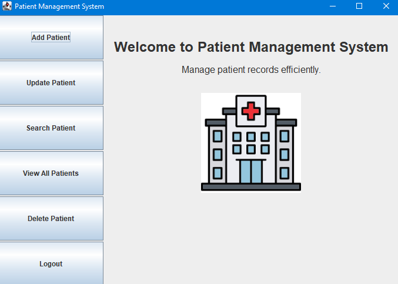
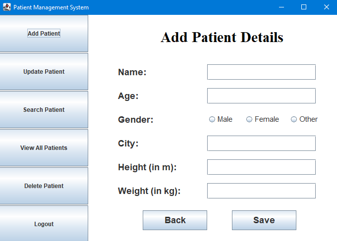
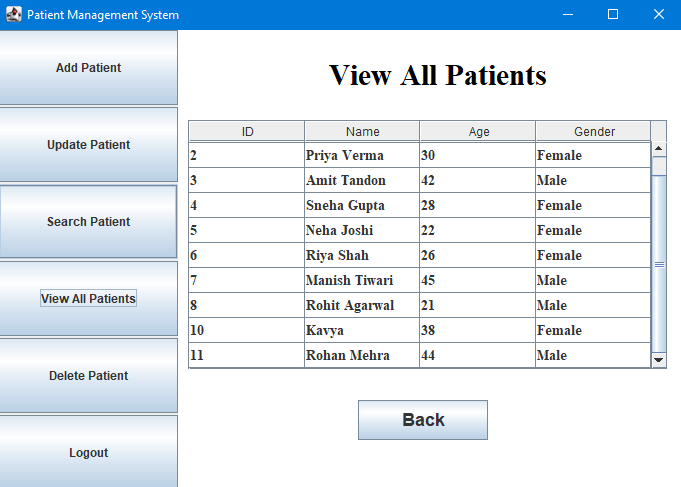
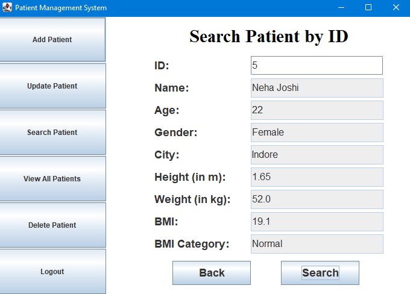

# 🏥 Patient Management System


A Java-based desktop application for managing patient medical records in a healthcare environment. Built with a clean MVC architecture, it provides authenticated access for doctors to perform complete patient management operations — including automatic BMI calculation — backed by a MySQL database via Hibernate ORM.

---

## ✨ Features

| Feature | Description |
|---|---|
| 🔐 Doctor Authentication | Secure login/signup with username and password validation |
| ➕ Add Patient | Register new patients with complete medical details |
| ✏️ Update Patient | Modify existing patient records with change detection |
| 🔍 Search Patient | Retrieve patient details by unique patient ID |
| 📋 View All Patients | Display all registered patients in a sortable table |
| 🗑️ Delete Patient | Remove patient records from the system |
| 📊 BMI Calculator | Automatic BMI calculation and health category assignment on save/update |
| 💾 Data Persistence | All records stored and managed in a MySQL database via Hibernate |

### BMI Categories

| BMI Range | Category |
|---|---|
| < 18.5 | Underweight |
| 18.5 – 24.8 | Normal |
| 24.9 – 29.8 | Overweight |
| ≥ 29.9 | Obese |

---

## 🛠️ Tech Stack

| Layer | Technology |
|---|---|
| Language | Java 11 |
| Build Tool | Apache Maven |
| GUI Framework | Java Swing (`javax.swing`) |
| ORM | Hibernate 6.5.2 |
| Persistence API | Jakarta Persistence API (JPA) 3.1.0 |
| Database | MySQL (via `mysql-connector-j` 9.4.0) |
| Testing | JUnit 3.8.1 |

---

## 🏗️ Architecture

This project follows the **MVC (Model-View-Controller)** pattern with a dedicated **DAO (Data Access Object)** layer for clean separation of concerns.

```
┌─────────────────────────────────────────────────┐
│                   View (Swing UI)               │
│        LoginFrame  │  SignUpFrame  │  Dashboard  │
└──────────────────────────┬──────────────────────┘
                           │ User Events
┌──────────────────────────▼──────────────────────┐
│               Controller Layer                  │
│  LoginController │ SignUpController │ Dashboard  │
│           Panel Controllers (Add/Update/etc.)   │
└──────────────────────────┬──────────────────────┘
                           │ Business Logic
┌──────────────────────────▼──────────────────────┐
│                  DAO Layer                      │
│          PatientDAO  │  DoctorDAO               │
└──────────────────────────┬──────────────────────┘
                           │ ORM (Hibernate/JPA)
┌──────────────────────────▼──────────────────────┐
│              MySQL Database                     │
│          patient table  │  doctor table          │
└─────────────────────────────────────────────────┘
```

### Application Startup Flow

```
Main.java
  └─→ Initialize Hibernate SessionFactory (FactoryProvider)
        └─→ LoginFrame displayed
              └─→ LoginController validates credentials
                    └─→ DoctorDAO authenticates via MySQL
                          └─→ DashboardFrame (on success)
                                ├─→ AddPatientController    → PatientDAO → MySQL
                                ├─→ UpdatePatientController → PatientDAO → MySQL
                                ├─→ SearchPatientController → PatientDAO → MySQL
                                ├─→ DeletePatientController → PatientDAO → MySQL
                                └─→ ViewAllPatientsController → PatientDAO → MySQL
```

---

## 📁 Project Structure

```
PatientManagementSystem/
├── pom.xml
└── src/
    └── main/
        ├── java/com/PMS/
        │   ├── Main.java                               # Entry point
        │   ├── DAO/
        │   │   ├── PatientDAO.java                     # Patient CRUD + BMI logic
        │   │   └── DoctorDAO.java                      # Doctor auth operations
        │   ├── model/
        │   │   ├── entity/
        │   │   │   ├── Patient.java                    # Patient JPA entity
        │   │   │   └── Doctor.java                     # Doctor JPA entity
        │   │   └── util/
        │   │       └── FactoryProvider.java            # Hibernate SessionFactory singleton
        │   ├── controller/
        │   │   ├── authController/
        │   │   │   ├── LoginController.java
        │   │   │   └── SignUpController.java
        │   │   └── DashboardController/
        │   │       ├── DashboardController.java
        │   │       └── panelController/
        │   │           ├── AddPatientController.java
        │   │           ├── UpdatePatientController.java
        │   │           ├── DeletePatientController.java
        │   │           ├── SearchPatientController.java
        │   │           └── ViewAllPatientsController.java
        │   └── view/
        │       ├── auth/
        │       │   ├── LoginFrame.java
        │       │   └── SignUpFrame.java
        │       └── dashboard/
        │           ├── DashboardFrame.java
        │           └── panels/
        │               ├── AddPatientPanel.java
        │               ├── UpdatePatientPanel.java
        │               ├── DeletePatientPanel.java
        │               ├── SearchPatientPanel.java
        │               └── ViewAllPatientsPanel.java
        └── resources/
            ├── hibernate.cfg.xml                       # Database & Hibernate config
            └── icons/
                └── hospital.png
```

---

## 🗄️ Database Schema

Hibernate auto-generates the schema using `hbm2ddl.auto=update`. The two core tables are:

### `patient` table

| Column | Type | Description |
|---|---|---|
| `id` | INT (PK, AUTO_INCREMENT) | Unique patient identifier |
| `name` | VARCHAR | Patient's full name |
| `age` | INT | Patient's age |
| `gender` | VARCHAR | Male / Female / Other |
| `city` | VARCHAR | Patient's city |
| `height` | DOUBLE | Height in metres |
| `weight` | DOUBLE | Weight in kilograms |
| `bmi` | DOUBLE | Calculated BMI (auto-computed) |
| `bmiCategory` | VARCHAR | Underweight / Normal / Overweight / Obese |

### `doctor` table

| Column | Type | Description |
|---|---|---|
| `id` | INT (PK, AUTO_INCREMENT) | Unique doctor identifier |
| `username` | VARCHAR | Login username (max 8 chars, no spaces) |
| `password` | VARCHAR | 4-digit numeric password |

---

## 📸 Screenshots

### Dashboard — Main Navigation
The central hub for all patient management operations.



---

### Add Patient
Enter patient details; BMI and category are calculated and stored automatically.



---

### View All Patients
Browse all registered patients in a scrollable table showing ID, Name, Age, and Gender.



---

### Search Patient by ID
Look up a specific patient's full record — including BMI and health category — by their unique ID.



---

## 🚀 Getting Started

### Prerequisites

- Java 11 or higher
- Apache Maven 3.x
- MySQL 8.x running locally
- An IDE (IntelliJ IDEA, Eclipse, or VS Code with Java extensions)

### 1. Clone the Repository

```bash
git clone https://github.com/ektachandak12/PatientManagementSystem.git
cd PatientManagementSystem
```

### 2. Create the Database

Open your MySQL client and run:

```sql
CREATE DATABASE patientManagementSystem;
```

> Hibernate will auto-create the `patient` and `doctor` tables on first run via `hbm2ddl.auto=update`.

### 3. Configure Database Credentials

Edit `src/main/resources/hibernate.cfg.xml` and update the connection properties to match your MySQL setup:

```xml
<property name="hibernate.connection.url">
    jdbc:mysql://localhost:3306/patientManagementSystem
</property>
<property name="hibernate.connection.username">your_username</property>
<property name="hibernate.connection.password">your_password</property>
```

### 4. Build the Project

```bash
mvn clean install
```

### 5. Run the Application

```bash
mvn exec:java -Dexec.mainClass="com.PMS.Main"
```

Or run `Main.java` directly from your IDE.

### 6. First-Time Setup — Register a Doctor

On the Login screen, click **Sign Up** to create a doctor account, then log in with those credentials.

> **Login constraints:**
> - Username: maximum 8 characters, no spaces
> - Password: exactly 4 numeric digits

---

## 📖 Usage Workflow

```
1. Launch app → Login screen appears
2. Sign up (first time) → Creates doctor credentials in DB
3. Log in with valid credentials → Dashboard opens
4. Select an operation from the left panel:
   │
   ├── Add Patient    → Fill in details → Click Save → BMI auto-calculated
   ├── Update Patient → Enter patient ID → Modify fields → Save changes
   ├── Search Patient → Enter patient ID → View full record with BMI
   ├── View All       → Scrollable table of all patients
   └── Delete Patient → Enter patient ID → Confirm deletion
5. Click Logout to return to the Login screen
```

---

## 🔮 Future Enhancements

- [ ] Password hashing (BCrypt) for secure credential storage
- [ ] Search patients by name or city in addition to ID
- [ ] Export patient records to CSV or PDF
- [ ] Patient appointment scheduling module
- [ ] Role-based access control (Admin vs. Doctor roles)
- [ ] Dashboard analytics with charts (average BMI, age distribution, etc.)
- [ ] Dark mode / theme customization for the UI
- [ ] Unit tests with JUnit 5 covering DAO and controller layers

---

## 👩‍💻 Author

**Ekta Naresh Chandak**

[](https://github.com/ektachandak12)
[](https://www.linkedin.com/in/ekta-chandak-bb43192b5/)

---

> Built with ❤️ using Java, Hibernate, and MySQL.
